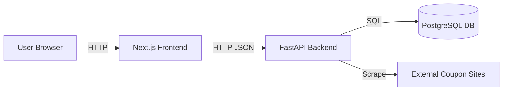

# Discounted Udemy Course Enroller - Web Platform

## Overview
The **Discounted Udemy Course Enroller** (Web Platform) is a modern, containerized application that automatically aggregates free Udemy coupons and displays them in a user-friendly course feed. It features a persistent database, background scraping, and a responsive frontend.

## Implemented Features

### 1. Modern Web Frontend
-   **Tech Stack**: Next.js 16 (App Router), React 19, Tailwind CSS v4.
-   **Course Feed**: A responsive grid layout displaying all available free courses.
-   **Live Data**: Fetches real-time data from the backend API.
-   **Visuals**: Clean card-based design showing course title, platform source, "FREE" badges, and direct enrollment links.

### 2. Powerful Backend API
-   **Tech Stack**: FastAPI (Python), APScheduler.
-   **Scraping Engine**: Reused and adapted the robust logic from the original project.
    -   *Enhanced*: Added support for handling `trk.udemy.com` redirect links.
-   **Endpoints**:
    -   `GET /courses`: efficient retrieval of courses from the database.
    -   `POST /scrape`: triggers asynchronous background scraping tasks without blocking the UI.

### 3. Persistent Database
-   **Tech Stack**: PostgreSQL 15.
-   **Integration**:
    -   Uses **SQLAlchemy** ORM for Python-to-Database mapping.
    -   Stores course details (Title, URL, Coupon Code, Price) permanently.
    -   Prevents duplicate entries via unique URL constraints.

### 4. Production-Ready Deployment
-   **Containerization**:
    -   **Frontend**: Multi-stage Dockerfile optimizing the Next.js build (~standalone mode).
    -   **Backend**: Slim Python image with all dependencies installed.
    -   **Database**: Official Postgres Alpine image.
-   **Orchestration**: A single `docker-compose.yml` file to spin up the entire stack with one command.

## Architecture Diagram



## How to Run

1.  Ensure **Docker** and **Docker Compose** are installed.
2.  Run the following command in this directory:
    ```bash
    docker-compose up --build
    ```
3.  Access the application:
    -   **Frontend**: [http://localhost:3000](http://localhost:3000)
    -   **API Docs**: [http://localhost:8000/docs](http://localhost:8000/docs)
    -   **Trigger Scrape**: To populate the database initially, click "Try it out" on `POST /scrape` in the API docs or run:
        ```bash
        curl -X POST http://localhost:8000/scrape
        ```

## Feature Checklist
- [x] **Collect free Udemy coupons**: Scrapes coupons from Real Discount, Discudemy, IDownloadCoupons, etc.
- [x] **Display course feed**: Web interface showing title, site source, and coupon validity.
- [x] **Store course history**: Database retention of all scraped courses.
- [x] **Background Updates**: Automated periodic scraping (every 15 mins) and manual trigger.
- [x] **Instant Scrape**: Frontend button to trigger scraping immediately.
- [x] **Responsive Design**: Mobile-friendly UI with Tailwind CSS.
- [x] **Containerized**: Easy deployment with Docker.
